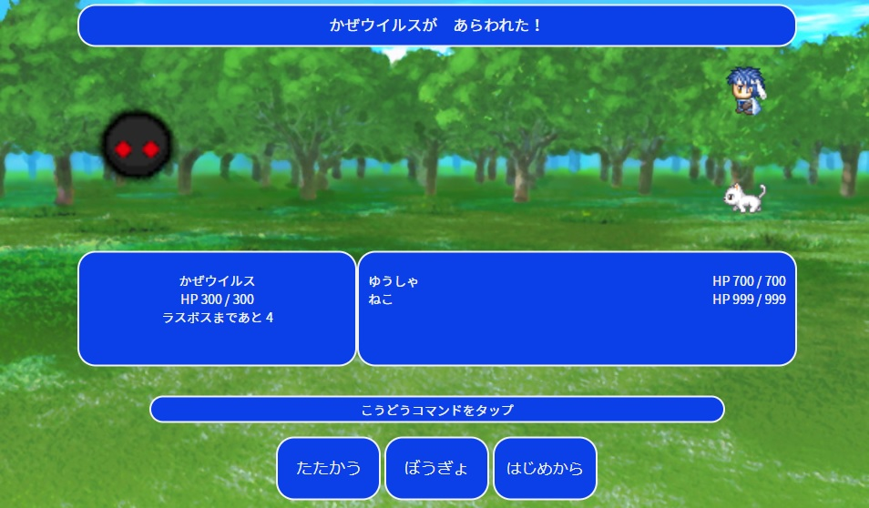

# ウイルスをやっつけろ〜F○風バトルゲーム〜

## アプリケーションの概要
 
フルスクラッチのphpで作成したF○風のバトルゲームです。

フルスクラッチのphpでオブジェクト指向の学習のため作成しました。

[デモページ](https://kurosuke-web.com/ff-battle/)

## 画面イメージ ##
 

 
## 機能と環境
 
- 人やモンスターでクラスを分け、それぞれメソッドを作成
- 開発環境: MAMP
- デモページ環境: Xsever
 
## 必要要件
 
- php: 7.4.2
- MySQL: 5.7.26
- Apache: 2.2.34
- jQuery: 3.3.1
 
## 遊び方

1. 「たたかう」もしくは「ぼうぎょ」をタップ（クリック）
2. ときどきねこが回復してくれます

## 作者

* 作成者：くろすけ
* Twitter：[@guroguro33](https://twitter.com/guroguro33)
 
## ライセンス
 
"ff-battle" is under [MIT license](https://en.wikipedia.org/wiki/MIT_License).